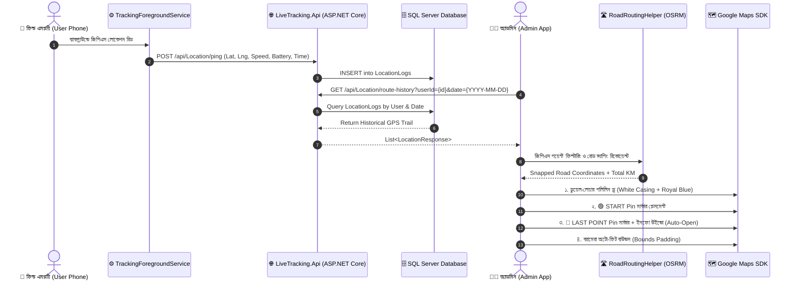

# 📍 Route History: Architecture, Workflow & Visualization Guide
**Live Tracking System (MOXX BD)**

---

## 📑 সূচিপত্র (Table of Contents)
1. [ওভারভিউ (Overview)](#1-ওভারভিউ-overview)
2. [সম্পূর্ণ আর্কিটেকচার ফ্লো (End-to-End Architecture Flow)](#2-সম্পূর্ণ-আর্কিটেকচার-ফ্লো-end-to-end-architecture-flow)
3. [ডেটা কালেকশন প্রসেস (Data Collection - Employee Side)](#3-ডেটা-কালেকশন-প্রসেস-data-collection---employee-side)
4. [রুট কুয়েরি ও ফিল্টারিং (Route Query & Filtering - Admin Side)](#4-রুট-কুয়েরি-ও-ফিল্টারিং-route-query--filtering---admin-side)
5. [রোড স্ন্যাপিং ও স্মুথিং ইঞ্জিন (Road Snapping & Smoothing Engine)](#5-রোড-স্ন্যাপিং-ও-স্মুথিং-ইঞ্জিন-road-snapping--smoothing-engine)
6. [গুগল ম্যাপস ভিজ্যুয়ালাইজেশন (Map Visualization Layer)](#6-গুগল-ম্যাপস-ভিজ্যুয়ালাইজেশন-map-visualization-layer)
7. [মার্কার ও লাইভ ইনফো বাবল (Markers & Info Bubbles)](#7-মার্কার-ও-লাইভ-ইনফো-বাবল-markers--info-bubbles)
8. [রুট সামারি কার্ড (Summary Analytics Card)](#8-রুট-সামারি-কার্ড-summary-analytics-card)

---

## 1. ওভারভিউ (Overview)
**Route History** ফিচারের মাধ্যমে অ্যাডমিন যেকোনো ফিল্ড কর্মী/ড্রাইভারের নির্দিষ্ট তারিখের সম্পূর্ণ যাতায়াত পথ (Travel Path), মোট অতিক্রান্ত দূরত্ব (Distance in KM), ভ্রমণের গতি (Speed), ডিভাইসের ব্যাটারি স্ট্যাটাস এবং স্টার্টিং ও লাস্ট লোকেশন বিস্তারিতভাবে গুগল ম্যাপে অ্যানালাইজ করতে পারেন।

---

## 2. সম্পূর্ণ আর্কিটেকচার ফ্লো (End-to-End Architecture Flow)

---

## 3. ডেটা কালেকশন প্রসেস (Data Collection - Employee Side)
- **সার্ভিস**: [`TrackingForegroundService.kt`](file:///d:/Shuvo/zynexbd/live_tracking/LiveTrackingSystem/AndroidApp/app/src/main/java/com/zynexbd/livetracking/services/TrackingForegroundService.kt)
- **ক্যাপচার্ড প্যারামিটার**:
  - `latitude`, `longitude` (নির্ভুল জিপিএস কোঅর্ডিনেটস)
  - `speed` (তাত্ক্ষণিক গাড়ির গতিবেগ)
  - `deviceBattery` (ফোনের বর্তমান ব্যাটারি শতকরা হার)
  - `recordedAtUtc` (ISO-8601 টাইমস্ট্যাম্প)
  - `accuracy` (মিটার একুরেসি লেভেল)

---

## 4. রুট কুয়েরি ও ফিল্টারিং (Route Query & Filtering - Admin Side)
- **অ্যাক্টিভিটি**: [`AdminRouteHistoryActivity.kt`](file:///d:/Shuvo/zynexbd/live_tracking/LiveTrackingSystem/AndroidApp/app/src/main/java/com/zynexbd/livetracking/activities/AdminRouteHistoryActivity.kt)
- **ইউজার সিলেকশন**: ড্রপডাউন স্পিনার থেকে কর্মী নির্বাচন।
- **তারিখ নির্বাচন**: `DatePickerDialog` দিয়ে তারিখ বাছাই। বাংলা ডিজিট থাকলে তা স্বয়ংক্রিয়ভাবে স্ট্যান্ডার্ড ASCII `YYYY-MM-DD` ফরম্যাটে কনভার্ট হয়ে ব্যাকএন্ডে রিকোয়েস্ট পাঠানো হয়।

---

## 5. রোড স্ন্যাপিং ও স্মুথিং ইঞ্জিন (Road Snapping & Smoothing Engine)
- **ইউটিলিটি**: [`RoadRoutingHelper.kt`](file:///d:/Shuvo/zynexbd/live_tracking/LiveTrackingSystem/AndroidApp/app/src/main/java/com/zynexbd/livetracking/utils/RoadRoutingHelper.kt)
- **কেন প্রয়োজন**: শুধু কাঁচা জিপিএস পয়েন্ট যোগ করলে রুট লাইন বিল্ডিং বা নদীর ওপর দিয়ে সোজাসুজি চলে যায়।
- **কার্যপদ্ধতি**:
  1. **Jitter Filter**: ১৫ মিটারের ভেতরের অপ্রয়োজনীয় ভাইব্রেশন বা স্ট্যাটিক পয়েন্ট স্বয়ংক্রিয়ভাবে রিমুভ করা হয়।
  2. **OSRM Routing Engine**: হাইওয়ে ও ড্রাইভিং রোড নেটওয়ার্কের ওপর জিপিএস পয়েন্টগুলোকে স্ন্যাপ করা হয়।
  3. **ফলব্যাক সেফটি**: ইন্টারনেট সমস্যা বা ওএসআরএম অফলাইন থাকলে রুটটি নির্ভুলভাবে স্ট্রেইট জিপিএস রুটে ফলব্যাক করে অ্যাপকে ক্র্যাশ থেকে বাঁচায়।

---

## 6. গুগল ম্যাপস ভিজ্যুয়ালাইজেশন (Map Visualization Layer)
ম্যাপে ট্র্যাফিক লেয়ার ও স্যাটেলাইট ব্যাকগ্রাউন্ডেও যেন রুটটি স্পষ্ট বোঝা যায়, তার জন্য **ডুয়েল লেয়ার হাই-কন্ট্রাস্ট পলিলিন** ব্যবহৃত হয়:

| লেয়ার | কালার | উইডথ (Width) | ক্যাপ ও জয়েন্ট | কাজ |
| :--- | :--- | :--- | :--- | :--- |
| **Outer Casing** | সলিড হোয়াইট (`#FFFFFF`) | `18f` | `RoundCap()`, `JointType.ROUND` | ম্যাপের ট্র্যাফিক ও রোডের ব্যাকগ্রাউন্ড থেকে লাইন আলাদা করে উজ্জ্বল রাখে। |
| **Primary Route** | ভাইব্রেন্ট রয়্যাল ব্লু (`#2563EB`) | `12f` | `RoundCap()`, `JointType.ROUND` | গুগল নেভিগেশন স্ট্যান্ডার্ড অ্যাক্টিভ ট্রাভেল রুট প্রদর্শন করে। |

---

## 7. মার্কার ও লাইভ ইনফো বাবল (Markers & Info Bubbles)

### ১. 🟢 START Marker (যাত্রা শুরুর পয়েন্ট):
- **কালার**: Green (`HUE_GREEN`)
- **টাইটেল**: `🟢 START: {Employee Name} ({Start Time})`
- **ডিটেইলস**: রেকর্ড টাইম এবং প্রারম্ভিক ব্যাটারি লেভেল।

### ২. 🔴 LAST POINT Marker (গন্তব্য বা সর্বশেষ অবস্থান):
- **কালার**: Red (`HUE_RED`)
- **টাইটেল**: `🔴 LAST POINT: {Employee Name} ({End Time})`
- **ডিটেইলস**: 
  - সর্বশেষ রেকর্ডের সময় (`hh:mm a`)
  - ডিভাইসের ব্যাটারি শতকরা হার (`🔋 %`)
  - যানবাহনের গতিবেগ (`🚗 Speed km/h`)
- **অটো-ইনফো উইন্ডো**: অ্যাডমিন সার্চ করামাত্রই এই লাস্ট পয়েন্টের মার্কার বাবলটি অটোমেটিক স্ক্রিনে ভেসে ওঠে (`showInfoWindow()`)।

### ৩. সিঙ্গেল পয়েন্ট সেফটি (Single Point Safety):
- ইউজারের পুরো দিনে মাত্র ১টি পয়েন্ট রেকর্ড থাকলেও সিস্টেম মিস না করে সরাসরি একটি **🔴 Current/Last Point** পিন মার্কার দিয়ে অবস্থান স্পষ্ট করে।

---

## 8. রুট সামারি কার্ড (Summary Analytics Card)
ম্যাপের ওপর ভেসে থাকা গ্লাস কার্ডে তাৎক্ষণিকভাবে নিচের তথ্যগুলো আপডেট হয়:
- **ড্রাইভারের নাম**: `Route: {User Name}`
- **ওয়েপয়েন্ট সংখ্যা**: যেমন `Waypoints: 48`
- **মোট দূরত্ব**: যেমন `Distance: 18.45 km`
- **রোড স্ন্যাপ স্ট্যাটাস**: `🛣️ Road Route` অথবা `📍 GPS Points`
- **লাইভ ট্র্যাফিক স্টেটাস**: `🚦 Traffic: Live`

---
*ডকুমেন্টটি LiveTrackingSystem এর স্ট্যান্ডার্ড অনুযায়ী প্রস্তুত করা হয়েছে।*
